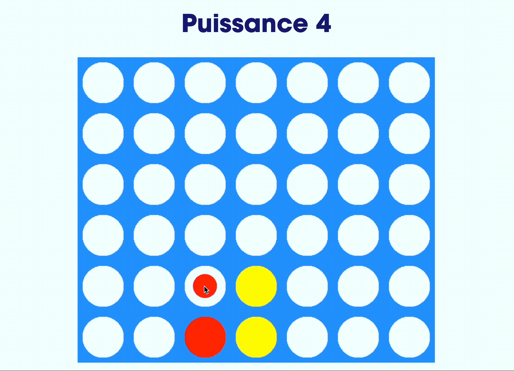
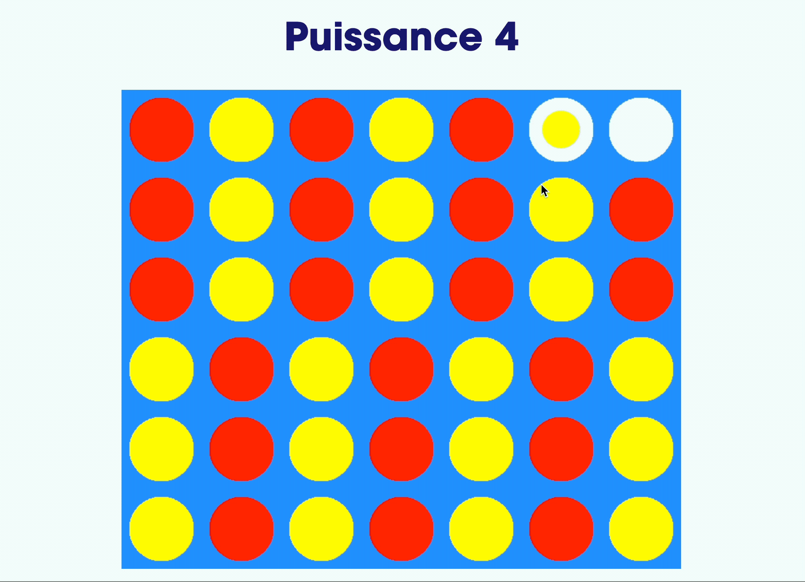

# Puissance 4

> An educational project at HEPL for MMI.

* * *

**Puissance 4** is an educational project, which will be used for `MMI` courses.

**Note:** the school where the course is given, the [HEPL](https://hepl.be) from Liège, Belgium, is a French-speaking school. From this point, the instruction will be in French. Sorry.

* * *

## Présentation
Dans le cadre de ce projet, j'ai voulu reproduire l'emblèmatique jeu [puissance 4](https://fr.wikipedia.org/wiki/Puissance_4). C'est un jeu de stratégie combinatoire abstrait qui se joue à 2, commercialisé pour la première fois en 1974 par la Milton Bradley Company et détenue depuis 1984 par la société Hasbro.

## [Play here](https://tecg-mmi-2022-2023.github.io/projet-mmi-juin-blancharSengaVita/)

## Les règles du jeu

Le Puissance 4 est un jeu de société pour deux joueurs, qui se joue sur une grille de 7 colonnes et 6 rangées. 

Chaque joueur dispose d'un ensemble de pions de couleur (généralement jaune et rouge) et tour à tour, ils insèrent un pion dans l'une des colonnes, en le laissant tomber jusqu'à ce qu'il atteigne la rangée la plus basse possible ou jusqu'à ce qu'il rencontre un autre pion.

Le but du jeu est d'aligner 4 pions de sa couleur, horizontalement, verticalement ou en diagonale, avant que son adversaire ne le fasse. 

Si toute la grille est remplie sans qu'il n'y ait de vainqueur, ça sera match nul

## Processus de création
Pour créer ce jeu la première chose que j'ai faite, c'est d'aller voir s'il n'y avait pas un tutoriel pour que je pouvais regarder pour comprendre la logique qu'il y avait derriere la création de la grille et la detection de la victoire.

J'ai choisi de regarder [cette vidéo](https://www.youtube.com/watch?v=vzxCC5ggyUc&t=916s&ab_channel=Mt.FordStudios), car il n'utilisait pas de html ni de css pour créer les composants du jeu, il a tout en canvas, même les messages de victoire ou de match nul. Il fallait juste 
- retranscrire le js en typescript.
- gérer le fond en css.
- les messages de victoire, de match de nul et debut de jeu en html.
- et utiliser le framework qu'on a créé.
Par contre, il ne respectait vraiment pas les bonnes pratiques qu'on a apprises en classe. 

- Il a écrit son code js dans une balise script.
- Son code css dans une balise link.
- Il écrit tout dans le meme fichier, toutes les fonctions toutes les classes qu'il a utilisées.
- Il utilise des var pour déclarer ses variables et ses constantes.
- il n'abuse pas assez de la POO.
- il n'utilise pas les égalités strictes dans les conditions

Il ne fonctionne pas non plus de la meme manière pour reset son jeu. J'ai ajouté créer des fonctions reset dans les models de mon jeu et je les appelle lorqu'on soumet le formulaire pour commencer le jeu et pour le redémarrer.

## Liste des choses qui reste à faire ou qui méritent d’être améliorés.

- Faire en sorte qu'on puisse jouer contre un ordinateur.
- Régler le fait que le jeu soit légèrement pixelisé.
